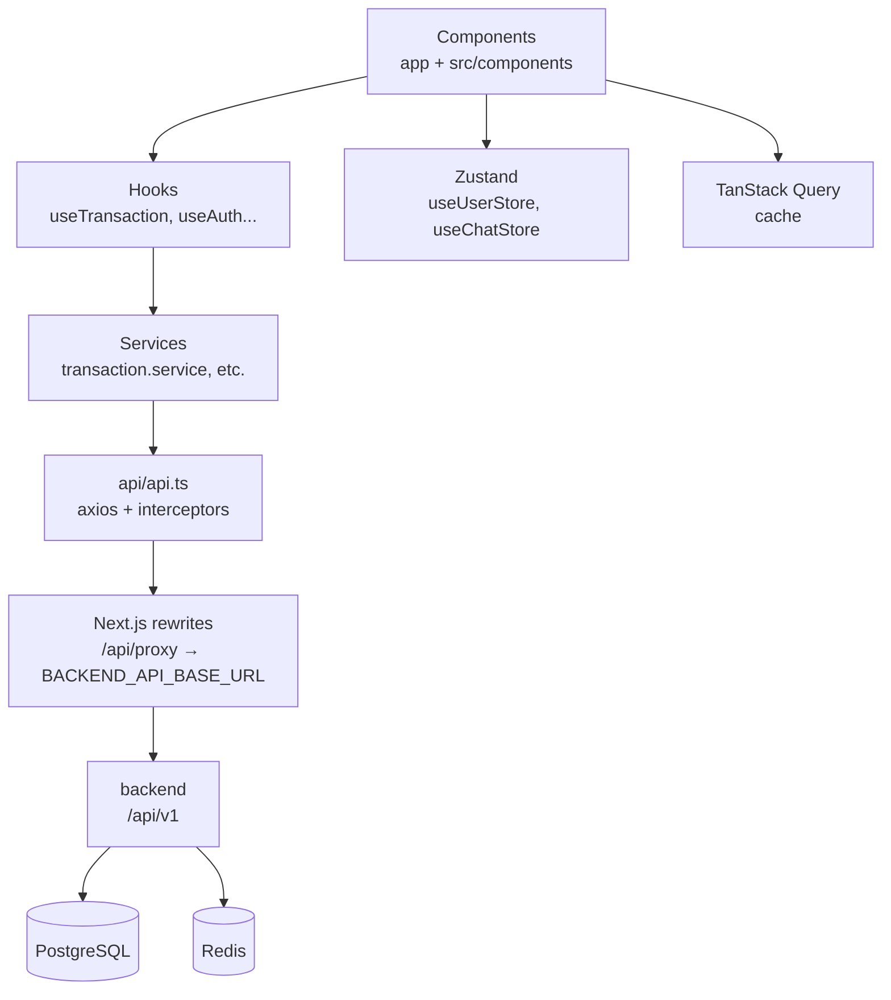

# Arquitectura — WEB

> [← Voltar ao índice](README.md) | [README principal](../README.md)

## 1. Visão Geral
Next.js 15 (App Router) + React 19 + Zustand (client state) + TanStack Query (server state) + Axios + Tailwind 4. Consome `backend` via `src/api/api.ts` com proxy `/api/proxy`.

## 2. Camadas
| Camada | Pasta | Responsabilidade |
|--------|-------|-----------------|
| **App/Rotas** | `app/` | Layouts, páginas, route groups `(auth)`/`(protected)`, `loading.tsx`, `not-found.tsx` |
| **Componentes** | `src/components/` | UI reutilizável (`ui/`), layout (`layout/`), domínios (`financial/`, `goals/`, `home/`, `charts/`) |
| **Hooks** | `src/hooks/` | Lógica de negócio + Query (`use-transaction`, `use-goal`, `use-chat`, `use-auth`, `use-balance`) |
| **Services** | `src/services/` | Chamadas HTTP tipadas (`ai.service`, `transaction.service`, `chat.service` SSE) |
| **Store** | `src/store/` | Zustand client state (`user-store`, `chat-store`, `ui-store`) |
| **API Client** | `src/api/` | Axios com interceptors JWT/refresh, `ApiError` |
| **Types** | `src/types/dtos/` | Contratos com backend |
| **Lib/Utils** | `src/lib/`, `src/utils/` | QueryClient, currency, api-error, helpers |
| **Config/Const** | `src/config/`, `src/constants/` | `env`, `routes.ts`, `brand-colors`, `mock-data` |

## 3. Fluxo de Dados
1. Componente `TransactionList` chama `useTransaction().list`
2. Hook usa `transactionService.list(pageable)` → `apiClient.get("/transactions", {params})`
3. `api.ts` injeta `Authorization: Bearer <token>` (de `useUserStore.getState().token`)
4. 401 → interceptor tenta `POST /auth/refresh` (cookie httpOnly) com deduplicação `isRefreshing` + `failedQueue` + `refreshPromise` → retry
5. Resposta → `Page<TransactionResponse>` → Query cache `["transactions", pageable]` → UI re-render
6. Mutation (`create`) → `queryClient.invalidateQueries` → refetch

## 4. Gestão de Estado
- **Server**: TanStack Query (`src/lib/query-client.ts`, `staleTime` 30s). Keys como `["transactions"]`, `["goals"]`, `["categories"]`.
- **Client**: Zustand. `useUserStore` persiste token em memória (`createJSONStorage` com persist), `useChatStore` guarda `conversationId` + `messages` + `isStreaming`.
- **Context**: `loading-context`, `cookie-consent`.

## 5. Routing
Ver [navegacao.md](navegacao.md) para detalhes. Middleware + App Router groups.

## 6. Tratamento de Erros
Interceptor cria `ApiError { message, errorCode, status, retryAfterSeconds }`. Fallback PT: “Não foi possível conectar…”. `errorCode` (ex: `EMAIL_NOT_VERIFIED`) usado para UX específica; não fazer `message` matching.

## 7. Observabilidade
PostHog (`posthog-js`, rewrites `/ingest/*` em `next.config.ts`), `instrumentation-client.ts`, Actuator backend.

## Próximos passos
- [Estrutura de Pastas](estrutura.md)
- [API Client](api-client.md)
- [Navegação](navegacao.md)
